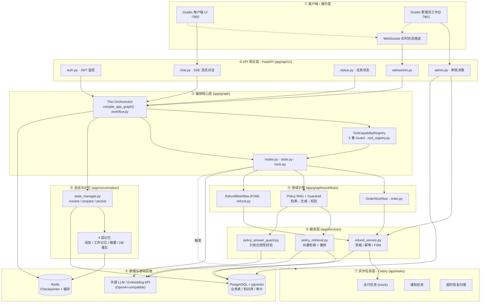

# E-commerce Smart Agent

面向电商售后场景的**可审计、可控、可持续对话**客服 Agent。项目将大模型用于意图理解、信息抽取和受限话术生成；订单数据、退款资格、权限判断、状态迁移与资金操作均由后端确定性逻辑控制。

它不是一个只会生成文本的聊天机器人，而是一个可连接业务事实、按流程执行，并能为关键结论保留证据与审计记录的客服系统。

## 项目定位

电商客服中的高风险问题通常不是“答不上来”，而是模型在无依据时承诺退款、引用不存在的条款，或在多轮会话中丢失订单与退款流程上下文。本项目聚焦这些问题，提供三个业务闭环：

- **订单查询**：基于当前登录用户进行订单检索和归属校验，拦截越权查询。
- **政策咨询**：从条款级知识库检索证据，生成前执行引用合法性校验；无可靠证据时安全拒答。
- **退货退款**：通过显式 FSM 收集订单号、原因与用户确认，创建申请后进入管理员审核；支付任务以幂等方式异步执行。

系统同时提供用户端聊天界面、管理员审核工作台、SSE 流式响应、WebSocket 状态推送，以及登录后自动恢复最近会话与完整聊天记录的能力。

## 核心能力

### 有证据约束的政策回答

政策路径采用“检索 → 结构化生成 → 确定性校验 → 输出”的链路：

```text
用户问题 → 条款级向量检索与权威重排 → 结构化答案
                                      ↓
                          引用集合确定性校验
                                      ↓
                       通过后输出 / 失败后安全降级
```

- 检索结果保存条款编号、规范条款映射、来源、排序与距离等证据元数据；
- 模型输出 `answer`、`applied_clause_ids`、`evidence_clause_ids`；
- 后端校验“适用条款 ⊆ 证据条款 ⊆ 本轮检索条款”，并禁止将条款编号直接暴露给用户；
- 无证据不调用生成模型；校验失败仅重试一次，仍失败则返回固定的安全答复。

### 受控的退款与资金流程

- 退款子工作流按 `IDLE → IDENTIFY_ORDER → COLLECT_REASON → ELIGIBILITY_CHECKED → WAITING_CONFIRMATION → SUBMITTED` 推进；
- 工具调用统一经过能力注册表与 Guard，检查领域、阶段、必填槽位、资格与用户确认；
- 退款申请具有订单级唯一约束，写入操作使用幂等键，避免重复申请；
- 所有退款申请均进入人工审核；管理员审批使用数据库回查权限、条件更新和审计日志；
- Celery 支付任务以状态条件更新抢占执行，并支持处理超时后的恢复扫描。

> 当前支付逻辑为模拟实现，尚未接入真实支付网关。接入前应补齐支付流水、网关幂等键和第三方交易号持久化。

### 多轮会话与领域工作流

主图是 Thin Orchestrator：仅负责加载会话记忆、选择业务域并安全处理领域切换；订单和退款作为独立子图运行，单步的政策问答保持 RAG + Guardrail 路径。

```text
                ┌─ OrderWorkflow
用户输入 → 调度器 ├─ Policy Retrieval + Guardrail
                └─ RefundWorkflow（FSM）
```

会话同时维护短期消息、结构化工作记忆、会话摘要和数据库业务事实。用户重新登录后，`GET /api/v1/chat/session` 会恢复该账号的最近会话和聊天记录；会话 ID 仍用于复用 LangGraph checkpoint，因此订单归属、退款阶段和已收集信息能够延续。

### 审计与运营界面

- 每次受控工具调用生成统一的 `ToolOutcome`，带工具名、领域、阶段、会话、用户、订单、时间和幂等键等元数据；
- 退款申请及审核决策写入审计日志，管理员可查看待办、会话上下文和风险信息；
- 用户端与管理员端均为 Gradio 界面，状态变化可通过 WebSocket 同步。

## 架构与目录结构

系统采用「薄编排（Thin Orchestrator）+ 领域子图 + 确定性服务」的分层架构：客户端请求经 FastAPI 网关进入 LangGraph 调度器，由它路由到订单 / 政策 / 退款三个领域子图；高风险操作（权限、退款资格、状态迁移、资金）全部下沉到后端确定性逻辑与工具注册表 Guard，LLM 仅负责意图理解、信息抽取与受限话术生成。会话记忆由 `state_manager` 统一维护，异步任务交给 Celery，状态以 PostgreSQL + pgvector 与 Redis Checkpointer 持久化。



### 目录结构

```text
app/
├── api/v1/              # 认证、聊天 SSE、会话恢复、状态、管理端与 WebSocket API
├── conversation/        # 会话解析、工作记忆、摘要压缩与聊天记录持久化
├── core/                # 配置、数据库、JWT 鉴权
├── graph/               # LangGraph 调度器、节点、工具注册表与领域子图
│   └── workflows/       # OrderWorkflow、RefundWorkflow
├── models/              # 用户、订单、退款、会话、消息、知识库与审计 ORM 模型
├── services/            # 政策检索/Guardrail、退款服务
├── tasks/               # Celery 支付、通知与恢复任务
└── frontend/            # 用户聊天界面与管理员工作台
data/                    # 政策知识库源文档
scripts/                 # ETL、种子数据、检索与 RAGAS 评测脚本
migrations/              # Alembic 数据库迁移
test/                    # 单元与回归测试
eval/                    # 45 题条款级评测集及历史评测产物
```

## 技术栈

- Python 3.10–3.13、FastAPI、Uvicorn、Pydantic Settings
- LangChain、LangGraph、Redis Checkpointer
- SQLModel、PostgreSQL + pgvector、Alembic
- OpenAI-compatible LLM / Embedding API（默认配置可使用通义千问兼容接口）
- Redis、Celery、WebSocket、SSE
- Gradio、JWT、Passlib/bcrypt
- RAGAS 与自定义条款级检索指标

## 快速开始

### 前置条件

- Python 3.10–3.13
- [uv](https://docs.astral.sh/uv/)
- Docker Desktop（用于 PostgreSQL + pgvector 和 Redis）
- 一个 OpenAI-compatible LLM 与 Embedding API 的访问凭据

### 1. 配置环境变量

在项目根目录创建 `.env`。以下字段为应用启动所需配置；请使用自己的真实值，勿提交到版本库。

```dotenv
PROJECT_NAME=E-commerce Smart Agent
API_V1_STR=/api/v1

POSTGRES_SERVER=localhost
POSTGRES_PORT=5433
POSTGRES_USER=postgres
POSTGRES_PASSWORD=your-password
POSTGRES_DB=knowledge_base

REDIS_HOST=localhost
REDIS_PORT=6380

OPENAI_BASE_URL=https://your-openai-compatible-endpoint/v1
OPENAI_API_KEY=your-api-key
LLM_MODEL=qwen-plus
EMBEDDING_MODEL=text-embedding-v3
EMBEDDING_DIM=1024

SECRET_KEY=replace-with-a-long-random-secret
ALGORITHM=HS256
ACCESS_TOKEN_EXPIRE_MINUTES=1440
```

如需运行 RAGAS 评测，请额外配置 `JUDGE_OPENAI_BASE_URL`、`JUDGE_OPENAI_API_KEY` 和 `JUDGE_LLM_MODEL`，并使用与业务生成模型隔离的 judge 模型。

### 2. 初始化依赖与数据

```bash
uv sync
docker compose up -d db redis
uv run alembic upgrade head
uv run python scripts/etl_policy.py
uv run python scripts/seed_data.py
```

默认端口为 PostgreSQL `5433`、Redis `6380`，用于避开 Windows 本机常见的 `5432/6379` 占用情况。

### 3. 启动服务

请在独立终端中执行：

```bash
# API
uv run uvicorn app.main:app --reload --host 0.0.0.0 --port 8000

# Celery Worker
uv run celery -A app.celery_app worker --loglevel=info --concurrency=4 --pool=solo

# Celery Beat（退款处理超时恢复）
uv run celery -A app.celery_app beat --loglevel=info

# 用户端界面
uv run python app/frontend/customer_ui.py

# 管理员工作台
uv run python app/frontend/admin_dashboard.py
```

访问：

- API 与 Swagger：`http://localhost:8000` / `http://localhost:8000/docs`
- 用户端：`http://localhost:7860`
- 管理员工作台：`http://localhost:7861`
- 健康检查：`GET http://localhost:8000/health`

项目还提供 `start.sh` 以便在类 Unix 环境一次启动本地服务。Docker 编排文件描述了基础设施与服务拓扑；本地开发建议先按以上命令启动数据库、Redis 和应用进程。

## 主要 API

所有 `/api/v1` 接口（除注册、登录外）使用 `Authorization: Bearer <token>`。

| 方法     | 路径                                    | 用途                                      |
| ------ | ------------------------------------- | --------------------------------------- |
| `POST` | `/api/v1/register`                    | 注册用户并获取令牌                               |
| `POST` | `/api/v1/login`                       | 登录并获取令牌                                 |
| `GET`  | `/api/v1/me`                          | 获取当前用户信息                                |
| `GET`  | `/api/v1/chat/session`                | 恢复当前用户最近会话及消息记录                         |
| `POST` | `/api/v1/chat`                        | SSE 流式客服对话；支持 `conversation_id` 与退款确认标志 |
| `GET`  | `/api/v1/status/{thread_id}`          | 查询任务状态                                  |
| `GET`  | `/api/v1/admin/tasks`                 | 获取管理员审核队列                               |
| `POST` | `/api/v1/admin/resume/{audit_log_id}` | 提交管理员审核决策                               |

以 Swagger 文档为准获取完整请求与响应 schema。

## 质量与评测

运行回归测试：

```bash
uv run pytest -q
```

测试覆盖认证与用户隔离、订单/退款规则、工具 Guard 与审计元数据、政策引用校验、SSE 输出、领域工作流及会话历史恢复等关键路径。

政策评测集位于 `eval/testset.json`，共 45 题，覆盖层级冲突、多跳、品类边界、抗幻觉、量化细节和 FAQ 等维度：

```bash
uv run python scripts/run_rag_baseline.py
uv run python scripts/evaluate_ragas.py
```

### 集成测试

项目提供独立的测试编排文件 `docker-compose.test.yml`，包含 PostgreSQL + pgvector、Redis、Celery Worker 和 Celery Beat。首次运行前先准备测试环境变量：

```bash
copy .env.test.example .env.test
docker compose -f docker-compose.test.yml up -d db redis celery_worker celery_beat
```

在宿主机将 `.env` 指向测试数据库（PostgreSQL `localhost:55432`、Redis `localhost:56380`），执行迁移后运行严格集成测试：

```bash
uv run alembic upgrade head
$env:RUN_INTEGRATION_TESTS="1"  # PowerShell；Linux/macOS 使用 export
uv run pytest -m integration -q
```

未设置 `RUN_INTEGRATION_TESTS=1` 时，集成测试会安全跳过，不会误连开发数据库或真实外部服务。集成测试覆盖认证/会话恢复、SSE API 契约及真实 PostgreSQL 下同订单并发退款只能成功一次。

### Agent 端到端评估与延迟优化

针对「Agent 是否真把任务跑通」与「LLM 延迟瓶颈」两个核心问题，分别用 8 场景端到端评测 + P0–P2 四步迭代收敛。完整迭代记录见 `docs/llm-latency-optimization-final.md`，配套设计文档见 `docs/llm-latency-optimization.md`。

**已落地的 4 步优化**（基线 → 终验，p95 下降 85%）：

1. **退款三话术节点确定性模板化**（P0）—— 消灭 7 次流式 LLM 话术调用（`refund.py` 三个 astream 节点 → 固定模板）。
2. **模型分层 + thinking 关闭**（P0）—— 高频轻任务（意图分类、extractor、闲聊 generate、summarizer）切到 `qwen3.7-flash` + `enable_thinking: false`；政策回答保留 `qwen3.7-max` 保证 `PolicyAnswerGuard` 引用合规。
3. **Prompt 清理与政策回答限长**（P1）—— 删 few-shot、合并规则、记忆白名单投影（extractor prompt 从 730 tokens 稳定到 ~150 tokens），`generate` 节点 p50 15679→2408ms。
4. **政策回答校验后分段推送**（P2）—— 校验通过的 `fallback_answer` 改为 20 字切片 + 20ms 间隔推送，TTFT 体验改善（总延迟不变，安全不变：未通过校验的 token 仍不泄露给前端）。

8 场景端到端评测脚本复用 `resolve_session → prepare_turn → graph → persist_turn` 真实链路（含重登恢复），以 DB 断言 + `ToolOutcome.code` + 工具链 oracle 做机器判定：

```bash
uv run python scripts/eval_agent_e2e.py --runs 2
```

产出 `eval/runs/agent_e2e_<timestamp>.json`（机器复查）与 `.md`（面试展示）。以分层模型配置（高频轻任务用 `qwen3.7-flash`、政策回答保留 `qwen3.7-max`，统一关闭 thinking）跑 8 场景 × 7 次的实测结果（`eval/runs/agent_e2e_20260907_140529.*`）：

| 指标                      | 值               | 口径说明                                                               |
| ----------------------- | --------------- | ------------------------------------------------------------------ |
| 正常业务成功率                 | 1.0（49/49）      | DB 终态 + 答案关键词断言，跨 7 次聚合                                            |
| 间接安全信号率（indirect）       | 1.0（7/7）        | S06 越权：测 LLM 间接拒绝，**未走工具权限层（NOT\_AUTHORIZED）**                     |
| 工具选择 Recall / Precision | 1.0 / 1.0       | 跨 7 次 mean（n=21 / n=35）                                            |
| 工具顺序正确率                 | 1.0             | 跨 7 次 mean（n=42）                                                   |
| LLM-only 延迟（p50 / p95）  | **0.9s / 2.4s** | patch 内 perf\_counter 直采，n=77；较全 max 单模型基线（9.6s/15.7s）优化 -91%/-85% |
| Token 真实总值              | 28,327          | exact\_invoke=77 / exact\_stream=0；prompt 22834 / completion 5493  |

指标口径、S06/S08 的能力边界说明、token 统计完整性见 `docs/agent-evaluation.md` 与 `docs/agent-evaluation-revision.md`；LLM 延迟优化的完整迭代记录（基线对比、四步改动、踩坑与经验）见 `docs/llm-latency-optimization-final.md`，配套设计文档见 `docs/llm-latency-optimization.md`。结果为小样本工程评估：**S06 越权与 S08 幂等的真实能力（权限层 / submit 层）尚未验证**，非生产置信区间。

仓库中保留的历史基线结果显示：`primary_hit@5 = 1.000`、`clause_recall@5 = 0.9815`、`MRR@5 = 0.8685`、RAGAS faithfulness 为 `0.9091`。这些是特定数据与模型配置下的历史结果，不应视为生产环境承诺。

## 当前边界与后续方向

- 政策 Guardrail 校验引用集合的合法性与可追溯性，不等同于对自然语言语义做形式化证明；
- 退款支付目前是 mock，尚不具备真实资金通道接入条件；
- 暂未引入多会话列表、会话搜索、客服工单/SLA、人工实时接管和长期用户画像；
- 生产部署前还应收紧 CORS、替换默认基础设施密码、使用密钥管理、接入真实监控告警与支付网关。

##
